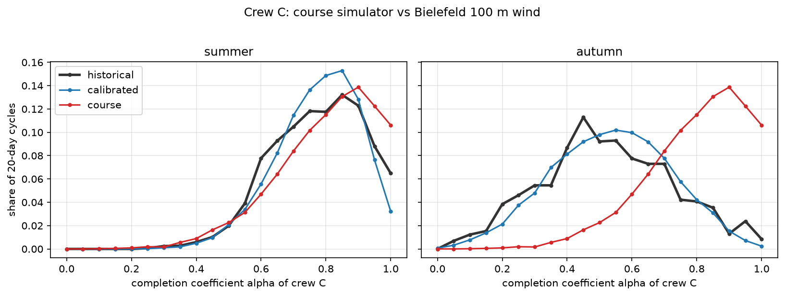
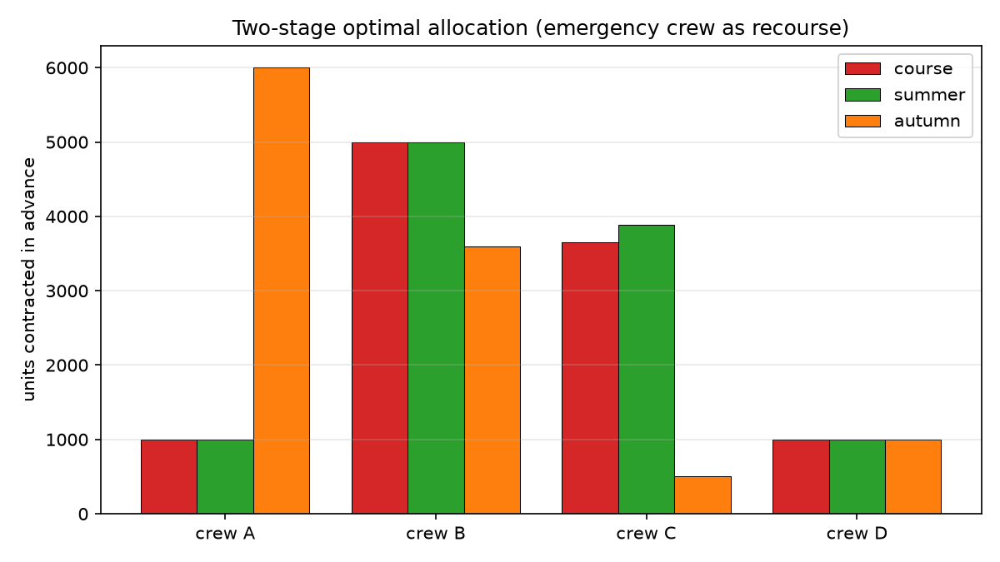
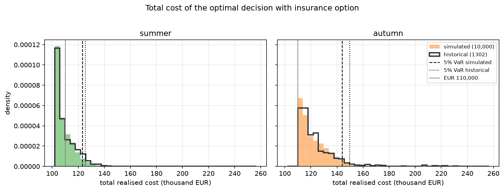

# Prefab assembly under weather risk

- **Project objective:** To determine which crane teams the project manager should contract with in advance
  to install 10,000 prefabricated building components at the lowest cost.
- **Core issue:** Strong winds can halt crane operations for several days, leading to increased costs and
  project delays.
- **Project assumptions:**
  - There are four crane teams available, each with different costs and wind-related limitations.
  - An emergency crane team can be utilized.
  - Weather-related risk insurance is available for purchase.
  - Wind conditions are modeled based on historical data.
- **Methods examined:**
  - *Deterministic model:* decision-making based on average wind conditions.
  - *Chance-constrained model:* factoring in the probability of strong winds and limiting the risk of work
    stoppage, so that all 10,000 units are installed without penalty in at least 95% of weather scenarios.
  - *Two-stage stochastic model:* initial contracts are selected first, followed by supplementary decisions
    (emergency team, penalties) based on actual wind conditions.
  - *Insurance extension:* the two-stage model with the option to buy weather insurance.
- **Data:** A wind simulator is calibrated using 31 years of weather data from Bielefeld, Germany.
- **Model evaluation:** Decisions are tested against actual data from historical 20-day periods.
- **Expected outcome:** Comparing models to identify the optimal crane team contracting strategy, reduce
  costs, and manage the risk of wind-induced work stoppages.

## Crane teams

| Team | Reservation fee (EUR/unit, always paid) | Execution fee (EUR/unit installed) | Min contract (units) | Max capacity (units) | Wind limit (km/h) |
|---|---|---|---|---|---|
| A | 4.00 | 7.00 | 1000 | 6000 | 43.3 |
| B | 4.00 | 6.00 | 1000 | 5000 | 37.9 |
| C | 3.50 | 5.50 | 500 | 4000 | 31.7 |
| D | 5.00 | 7.00 | 1000 | 4000 | 34.4 |

A team works on a day if the wind stays at or below its limit. Units not installed after 20 days cost a
delay penalty of EUR 40 each. The emergency team costs EUR 16 per unit (up to 4000 units). The insurance
costs EUR 4,000 and reimburses up to EUR 20,000 of penalties.

## Main finding

The same project needs a different contractor mix depending on the season. In summer the cheap but
wind-sensitive team C carries the work; in autumn the model shifts to the robust team A at its maximum.
Moving construction from summer to autumn raises the expected cost by about 13% and the tail risk
(5% CVaR, historical) by about 40%.

## Key results

Calibrated on daily maximum wind at 100 m, Bielefeld, 1995–2025 (Open-Meteo / ERA5).

| | course simulator | summer (May–Aug) | autumn (Oct–Nov) |
|---|---|---|---|
| expected completion α, teams A / B / C / D | 0.95 / 0.90 / 0.80 / 0.85 | 0.97 / 0.92 / 0.77 / 0.85 | 0.87 / 0.75 / 0.53 / 0.64 |
| day-to-day persistence ρ | 0.65 | 0.45 | 0.59 |
| two-stage allocation A / B / C / D | 1000 / 5000 / 3647 / 1000 | 1000 / 5000 / 3882 / 1000 | 6000 / 3600 / 500 / 1000 |
| expected cost, simulated / historical (EUR) | 112,472 / – | 110,408 / 111,100 | 125,042 / 126,623 |
| 5% CVaR, simulated / historical (EUR) | 150,056 / – | 131,913 / 133,833 | 169,963 / 187,236 |
| value of the stochastic solution (EUR) | 2,697 | 1,545 | 4,158 |
| 95% chance constraint | feasible | feasible | **infeasible** |

1. **The course simulator describes a Bielefeld summer.** Its completion fractions match May–August almost
   exactly. In autumn the probability that team C works on half the days or fewer is 52% in reality versus
   6% in the course simulator.
2. **Season reverses the allocation.** Team A goes from its minimum (1000) in summer to its maximum (6000) in
   autumn, team C the other way round.
3. **Uncertainty is worth more in autumn.** The value of the stochastic solution almost triples.
4. **A 95% no-penalty guarantee is impossible in autumn** with these four teams, even at full capacity.
5. **The calibrated simulator is slightly optimistic in the tail.** Evaluated on real history, the summer
   chance-constrained plan misses the target in 9.0% of periods instead of the planned 5%, and the autumn
   CVaR is about 10% higher than simulated.
6. **Weather insurance (EUR 4,000) is bought in every case**, partly because reimbursed penalties up to the
   EUR 20,000 cap cost nothing at the margin, so the model lets the first 500 missing units go to penalty
   instead of paying the emergency team.







## Method

**Wind data.** Daily maximum of hourly wind speed at 100 m (the working height of a tower crane boom) from
the Open-Meteo ERA5 archive. Wind at 10 m was too calm to create risk; 10 m gusts made the problem
infeasible even on average.

**Calibration.** The course simulator maps a Gaussian AR(1) series through a Weibull quantile function.
A Weibull marginal (with two or three parameters) missed the share of calm days at the team thresholds by
3–6 percentage points, so the calibrated simulator keeps the AR(1) dependence but uses the empirical
distribution of each season as marginal (Gaussian copula). ρ is the lag-1 correlation of the normal scores
of consecutive days, estimated separately for each season.

**Models** (python-mip, CBC), each solved on 200 scenarios: deterministic (expected completion fractions),
joint chance constraint (big-M formulation), two-stage with emergency recourse, and two-stage with a binary
insurance decision.

**Evaluation.** Every decision is evaluated on 10,000 new simulated scenarios and on all historical 20-day
windows of the season (3,224 in summer, 1,302 in autumn). Expected completion fractions, optimisation
scenarios and validation scenarios use three different random seeds.

## Limitations

- A 20-day working cycle is taken as 20 consecutive calendar days.
- A team works on a day if the daily maximum 100 m wind is at or below its limit; no partial days.
- AR(1) persistence fades faster than real weather regimes and ignores differences between years, which is
  why the simulator underestimates the tail compared with history.
- All models minimise expected cost. The two-stage plan has the lowest mean cost but not the lowest CVaR;
  a risk-averse objective (e.g. mean-CVaR) would be the natural next step.
- Historical windows overlap, so they are not independent observations.

## How to run

```bash
python -m venv .venv
source .venv/Scripts/activate      # Windows Git Bash; on Linux/macOS: source .venv/bin/activate
pip install -e ".[dev]"
python scripts/run_pipeline.py --refresh   # download wind data and run everything
python -m pytest -q                        # tests
```

All inputs (site, wind variable, seasons, team data, prices, seeds) are in `config/params.yaml`.

## Project structure

```
config/params.yaml          all model inputs
src/prefabrisk/
    weather.py              Open-Meteo download (10 m wind, gusts, 100 m wind)
    calibration.py          AR(1) persistence and empirical marginal per season
    scenarios.py            wind simulator, completion coefficients, historical windows
    models.py               deterministic, chance-constrained, two-stage, insurance, VSS
    risk.py                 out-of-sample cost, shortfall probability, VaR, CVaR
    plots.py                figures
scripts/run_pipeline.py     end-to-end analysis
tests/                      sanity checks
results/                    summary.json and figures
```

## Background

The idea for this project comes from a homework assignment in the course *Combining OR and Data Science*
(Prof. Dr. Michael Römer, Bielefeld University, summer term 2026). The cost and capacity figures of the
crane teams are taken from the assignment; the course's synthetic weather simulator is replaced by one
built on real data.

| | Course assignment | This project |
|---|---|---|
| Weather | fixed synthetic simulator with given parameters | 31 years of real wind data via the Open-Meteo API |
| Wind variable | not specified | chosen from data: 10 m wind, 10 m gusts and 100 m wind compared, 100 m selected |
| Simulator | parameters given | persistence estimated per season; Weibull fit tested and rejected, empirical marginal used instead |
| Seasons | one setting | summer and autumn compared, showing how timing changes the optimal plan |
| Validation | simulated scenarios only | also tested on 4,500 real historical 20-day periods, quantifying model risk |
| Model correction | — | coverage constraint of the insurance model corrected (an equality capped the allocation at 10,000 units) |
| Methodology | — | separate random seeds for estimation, optimisation and validation |
| Engineering | single notebook | Python package, config file, reproducible pipeline, automated tests |

Weather data: [Open-Meteo](https://open-meteo.com) (CC BY 4.0), based on ERA5 reanalysis.